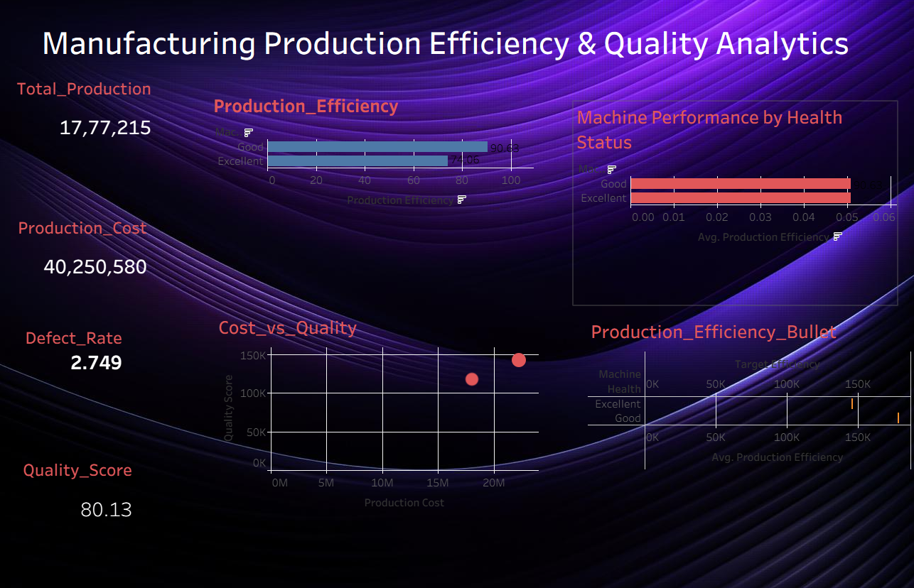

<div align="center">

# Manufacturing Production Efficiency & Quality Analytics

End-to-End Manufacturing Analytics Project using **Python, MySQL, SQL, and Tableau**


---

## Project Overview

This project analyzes manufacturing production data to evaluate production efficiency, product quality, operational performance, and manufacturing risks.

The workflow includes data cleaning, exploratory data analysis, feature engineering, SQL-based business analysis, and an interactive Tableau dashboard to provide actionable manufacturing insights.

---


## Objectives

- Analyze production performance
- Evaluate product quality
- Measure production efficiency
- Identify manufacturing risks
- Analyze machine health
- Build an interactive Tableau dashboard
- Generate business insights using SQL

---

## Tech Stack

- Python
- Pandas
- NumPy
- Matplotlib
- Seaborn
- MySQL
- SQL
- Tableau
- Jupyter Notebook
- VS Code

---

## Project Workflow

```text
Raw Dataset
      │
      ▼
Data Understanding
      │
      ▼
Data Cleaning
      │
      ▼
Exploratory Data Analysis
      │
      ▼
Feature Engineering
      │
      ▼
SQL Analysis
      │
      ▼
Tableau Dashboard
      │
      ▼
Business Insights
```

---

## Folder Structure

```text
Manufacturing_Production_Efficiency_Quality_Analytics/
│
├── data/
│   └── raw/
│       ├── manufacturing_defect_dataset.csv
│       └── manufacturing_feature_engineered.csv
│
├── images/
│   ├── dashboard.png
│   ├── histogram.png
│   ├── heatmap.png
│   └── boxplot.png
│
├── notebooks/
│   └── manufacturing_analysis.ipynb
│
├── sql/
│   └── manufacturing_database.sql
│
├── src/
│   ├── data_understanding.py
│   ├── data_cleaning.py
│   ├── eda.py
│   ├── feature_engineering.py
│   └── import_to_mysql.py
│
├── tableau/
│   └── dashboard5.twb
│
├── requirements.txt
└── README.md
```

---

## Dataset

**Source**

https://www.kaggle.com/datasets/rabieelkharoua/predicting-manufacturing-defects-dataset

---

## Exploratory Data Analysis

### Correlation Heatmap


---

### Production Distribution


---

### Outlier Detection


---

## Feature Engineering

The following business features were created:

- Production Efficiency
- Machine Utilization
- Downtime Percentage
- Defect Percentage
- Productivity Score
- Machine Health
- Risk Category

---

## SQL Analysis

The project includes SQL scripts covering:

- Database creation
- Table creation
- Data import
- Aggregate analysis
- GROUP BY
- HAVING
- CASE statements
- Views
- Window functions
- Business queries

---

## Tableau Dashboard

The dashboard provides insights into:

- Production KPIs
- Production Efficiency
- Quality Score
- Production Cost
- Machine Health
- Risk Category
- Manufacturing Performance

### Dashboard Preview



---

## Business Insights

- Production efficiency varies across machine conditions.
- High-risk categories show higher defect percentages.
- Better machine health is associated with improved quality scores.
- Productivity score helps identify efficient manufacturing operations.
- Production cost and quality score reveal operational trade-offs.

---

## Installation

Clone the repository

```bash
git clone https://github.com/SanthoshAnalytics/Manufacturing_Production_Efficiency_Quality_Analytics.git
```

Install dependencies

```bash
pip install -r requirements.txt
```

Launch Jupyter Notebook

```bash
jupyter notebook
```

---

## Future Improvements

- Predictive defect detection
- Machine learning models
- Streamlit dashboard
- Real-time production monitoring
- Cloud database integration

---

## Author

**Santhosh**

GitHub

https://github.com/SanthoshAnalytics
